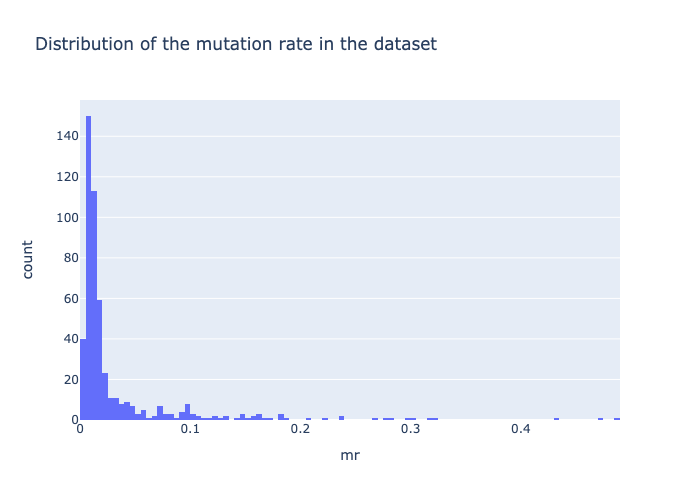
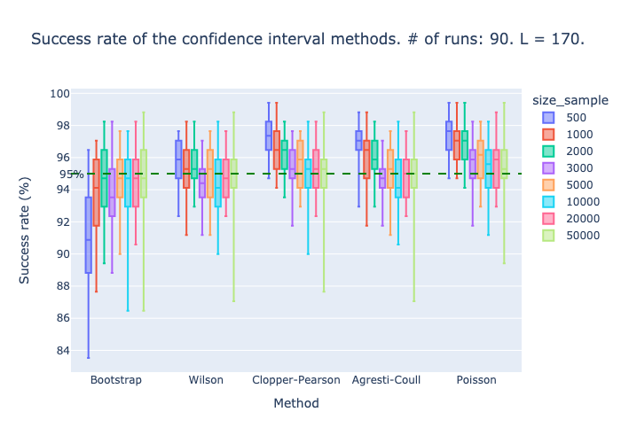

# DMS confidence intervals

## Installation

```bash
pip install dms_ci
```

## Usage

```python
import numpy as np
from dms_ci import dms_ci

N = np.array([100, 100, 100, 100, 100, 100, 100, 100, 100, 100])
n = np.array([10, 10, 10, 10, 10, 10, 10, 10, 10, 10])

low, high = dms_ci(N, n)
```

## About this package

This package provides a method to calculate confidence intervals for the DMS-MaPseq method, described below. The method is based on the Wilson score interval, which is described in detail below.


```python
>>> from dms_ci import dms_ci
>>> print(dms_ci.__doc__)
```
```text
Provides confidence intervals for DMS-MaPseq data.

Parameters
----------

N : array_like
    Number of reads for each position.

n : array_like
    Number of mutations for each position.

alpha : float, optional
    Significance level of the confidence interval. Default is 0.05.

Returns
-------

low : array_like
    Lower confidence interval.

high : array_like
    Upper confidence interval.

Notes
-----

The confidence intervals are calculated using the Wilson score interval.
```


## About the DMS-MaPseq method

DMS-MaPseq is a chemical probing method combined with high throughput sequencing used to study RNA structure. The method is based on the chemical modification of RNA with a DMS reagent, which is then sequenced. The resulting data is a set of modified nucleotides, which can be used to infer the structure of the RNA. The DMS-MaPseq method is described in detail in the [DMS-MaPseq paper](https://pubmed.ncbi.nlm.nih.gov/33326078/).


## About the confidence intervals method

The confidence intervals method is based on the assumption that the number of modified nucleotides is a binomial distribution. The confidence intervals are calculated using the Wilson score interval, which has shown to perform better than bootstrapping for small sample sizes (<3,000 reads). The method is decribed in details below.

### Basics and terminology

The DMS-MaPseq method consists in amplificating one or several RNA molecules with a PCR, and then sequencing a sub-sample of the resulting RNA. The resulting data is a set of modified nucleotides, which can be used to infer the structure of the RNA. The mutation rate is typically around 1% to 10% for a given position.

- ``mutation`` = substitution of a nucleotide by another nucleotide
- ``read`` = a sequence of nucleotides that has been sequenced
- ``position`` = the position of a nucleotide in a sequence
- ``mutation rate`` = the probability of observing a mutation at a given position

We want to know, when observing a mutation rate at a certain position, what is a confidence interval for this value.

### Assumptions

We will assume that:
- The experiment is perfectly reproducible.
- The sequencing error follows a binomial distribution $\binom{N}{10^{-3}}$.
- The only source of error is the random sampling of reads.
- The mutation rate is constant across the positions. This is not true in practice, but it is a good approximation for the purpose of this method (see **Why can we approximate the number of mutations with a binomial distribution** below).

Our model is the following: $$ p ~ \binom{N}{\hat{p}} + \binom{N}{10^{-3}} $$

where $p$ is the number of mutations, $N$ is the number of reads, and $\mu$ is the mutation rate.

### Method 

We use the **Wilson score interval**, which is a method to calculate confidence intervals for binomial distributions.

$$ \hat{p} = \frac{n}{N} $$

$$ z_{\alpha/2} = \Phi^{-1}(1-\alpha/2) $$

$$ \hat{p} \pm z_{\alpha/2} \sqrt{\frac{\hat{p}(1-\hat{p})}{N}} $$

where $n$ is the number of mutations, $N$ is the number of reads, and $z_{\alpha/2}$ is the $1-\alpha/2$ quantile of the standard normal distribution.

### Comparing experimentally different methods for binomial distributions confidence intervals

We compared the performances of the following methods:
- Bootstrapping
- Wilson score interval
- Clopper-Pearson interval
- Agresti-Coull interval
- Poisson interval by approximating the binomial distribution with a Poisson distribution
   
Wilson score has shown to be the best method for small sample sizes (<3,000 reads), and performs comparably to best-performing bootstrapping for larger sample sizes.

We use 4 real datasets to compare the methods. The mutation rate distribution across the positions is shown in the following figure.



The following figure shows the results of a simulation comparing the performance of different methods for binomial distributions confidence intervals. 
1. We loaded ``4 real datasets`` of over ``200,000 reads``, each read being ``170 nucleotides`` long. The mutation rate distribution across the positions is shown in figure A.
2. We subsampled ``N = [500, 1000, 2000, 3000, 5000, 10000] reads``,  ``10,000 times`` from each dataset, and calculated the confidence intervals for each position using the different methods.
3. For each read of ``170 nucleotides``, we calculated how many times the true mutation rate was within the confidence interval for each method. The distribution of this "success rate" is shown in figure B. 

A good method should have a small bias (e.g, be centered around 5%) and a small variance. 




### Why can we approximate the number of mutations with a binomial distribution?

Let's say we have a set of ``N`` reads of a single nucleotide, and ``n`` of them are mutated. The mutation rate is then ``n/N``. We want a confidence interval for this mutation rate.

Let's define $p_i$ the probability of mutation for the i-th read. Then ``n`` follows the distribution $f([p_1, p_2, ..., p_N]) := \sum_{i=1}^{N} X_i$, where $X_i$ is a Bernoulli random variable with parameter $p_i$.

According to [the binomial sum variance inequality](https://en.wikipedia.org/wiki/Binomial_sum_variance_inequality), the variance of the sum of $N$ independent Bernoulli random variables is bounded by $Np(1-p)$, where $p$ is the mean of the Bernoulli random variables. In our case, 

$$ Var(f([p_1, p_2, ..., p_N])) ≤ Np(1-p) $$ 

where $p = \frac{1}{N} \sum_{i=1}^{N} p_i $.

We can then use the binomial distribution $X \sim Bin(N, p)$ to approximate $f([p_1, p_2, ..., p_N])$.

### Select N given a maximum confidence interval width and a maximum mutation rate

Read the following plot to understand how to select N given a maximum confidence interval width and a maximum mutation rate.


