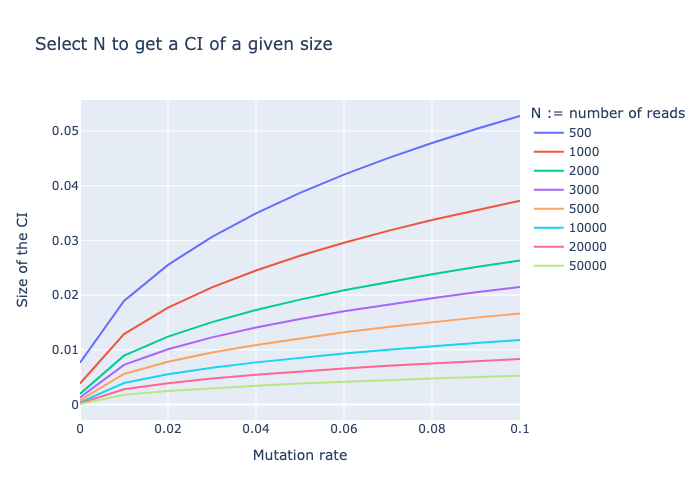

# DMS confidence intervals

## Installation

```bash
pip install dms_ci
```

## Usage

```python
import numpy as np
from dms_ci import dms_ci

N = np.array([100, 100, 100, 100, 100, 100, 100, 100, 100, 100])
n = np.array([10, 10, 10, 10, 10, 10, 10, 10, 10, 10])

low, high = dms_ci(N, n)
```

## About this package

This package provides a method to calculate confidence intervals for the DMS-MaPseq method, described below. This method assumes that the only variance in the DMS-MaPseq signal is due to reads subsampling. 


```python
>>> from dms_ci import dms_ci
>>> print(dms_ci.__doc__)
Provides confidence intervals for DMS-MaPseq data.

    Parameters
    ----------

    p : array_like
        Number of mutations for each position.

    n : array_like
        Number of reads for each position.

    alpha : float, optional
        Significance level of the confidence interval. Default is 0.05.

    Returns
    -------

    low : array_like
        Lower confidence interval.

    high : array_like
        Upper confidence interval.

```


## About the DMS-MaPseq method

DMS-MaPseq is a chemical probing method combined with high throughput sequencing used to study RNA structure. The method is based on the chemical modification of RNA with a DMS reagent, which is then sequenced. The resulting data is a set of modified nucleotides, which can be used to infer the structure of the RNA. The DMS-MaPseq method is described in detail in the [DMS-MaPseq paper](https://pubmed.ncbi.nlm.nih.gov/33326078/).


## About the confidence intervals method

The confidence intervals are calculated by modeling the DMS-MaPseq experiment by a binomial distribution. We use the conjugate distribution Beta to model the mutation fraction in the sample based off the observation we have.

### Basics and terminology

The DMS-MaPseq method consists in amplificating one or several RNA molecules with a PCR, and then sequencing a sub-sample of the resulting RNA. The resulting data is a set of modified nucleotides, which can be used to infer the structure of the RNA. The mutation rate is typically around 1% to 10% for a given position.

- ``mutation`` = substitution of a nucleotide by another nucleotide
- ``read`` = a sequence of nucleotides that has been sequenced
- ``position`` = the position of a nucleotide in a sequence
- ``mutation rate`` = the probability of observing a mutation at a given position

We want to know, when observing a mutation rate at a certain position, what is a confidence interval for this value.

### Assumptions

We will assume that:
- The only sources of error are the random sampling of reads.
- The mutation rate is constant across the reads fot a certain position. This is not true in practice, but it is a good approximation for the purpose of this method (see **Why can we approximate the number of mutations with a binomial distribution** below).
- The experiment is perfectly reproducible.

### Model 

We model the substitution rate in the sample as:

$$ p \sim Beta(\alpha, \beta) $$
$$ \alpha = N_{mutations} $$
$$ \beta = N_{reads} - N_{mutations} $$


### Why can we approximate the number of mutations with a binomial distribution?

Let's say we have a set of ``N`` reads of a single nucleotide, and ``n`` of them are mutated. The mutation rate is then ``n/N``. We want a confidence interval for this mutation rate.

Let's define $p_i$ the probability of mutation for the i-th read. Then ``n`` follows the distribution 
$$f([p_1, p_2, ..., p_N]) := \sum_{i=1}^{N} X_i$$
where $X_i$ is a Bernoulli random variable with parameter $p_i$.

According to [the binomial sum variance inequality](https://en.wikipedia.org/wiki/Binomial_sum_variance_inequality), the variance of the sum of $N$ independent Bernoulli random variables is bounded by $Np(1-p)$, where $p$ is the mean of the Bernoulli random variables. In our case, 

$$ Var(f([p_1, p_2, ..., p_N])) ≤ Np(1-p) $$ 

$$p = \frac{1}{N} \sum_{i=1}^N p_i $$

Therefore, a confidence interval based on the binomial distribution $X \sim Bin(N, p)$ will encompass $f([p_1, p_2, ..., p_N])$.

### Select N given a maximum confidence interval width and a maximum mutation rate

Read the following plot to understand how to select N given a maximum confidence interval width and a maximum mutation rate.



